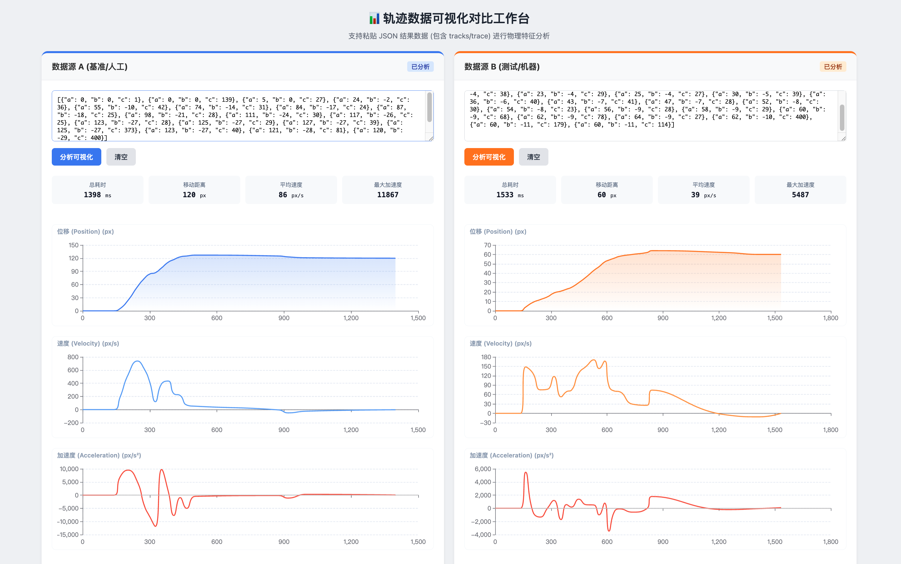

# 滑块验证码轨迹生成器 (Slider Trajectory Generator)

基于 LLM（Qwen2.5-0.5B）微调的滑块验证码轨迹生成工具。通过深度学习模型生成符合人类行为特征的滑块移动轨迹。

## 📸 效果演示

### 生成轨迹示例



### 验证码示例


## ✨ 特性

- 🤖 基于阿里通义千问 Qwen2.5-0.5B-Instruct 模型微调
- 🎯 使用 LoRA 技术进行高效微调
- 📊 生成符合人类行为特征的自然轨迹
- 🚀 支持自定义目标距离和画布长度
- 🛠️ 内置可视化工具，方便测试和调试
- ⚡ 支持 CUDA、MPS（Apple Silicon）和 CPU 多种运行环境

## 📋 项目结构

```
slider_trajectory_gen/
├── llm_generator.py          # 轨迹生成器（推理）
├── train_lora.py              # LoRA 微调脚本
├── download_model.py          # 模型自动下载脚本
├── training_data.jsonl        # 训练数据集
├── requirements.txt           # Python 依赖
├── models/                    # 模型保存目录
│   └── final_model/          # 微调后的最终模型
├── tools/                     # 工具集
│   └── slider-tool.html      # 可视化测试工具
└── img/                       # 示例图片
```

## 🔧 环境要求

- Python 3.8+
- PyTorch 2.0+
- CUDA 11.8+ (可选，用于 GPU 加速)
- 8GB+ RAM (推荐 16GB+)

## 📦 安装

### 1. 克隆项目

```bash
git clone <repository-url>
cd slider_trajectory_gen
```

### 2. 安装依赖

```bash
pip install -r requirements.txt
```

### 3. 下载预训练模型

你可以从 GitHub Releases 下载已经训练好的模型，无需重新训练。

#### 方式一：自动下载（推荐）

运行自动下载脚本：

```bash
python download_model.py
```

脚本会自动：
- 获取最新版本的模型
- 下载并显示进度
- 自动解压到正确的目录
- 验证安装是否成功

#### 方式二：手动下载

1. 访问 [Releases 页面](https://github.com/wilinz/slider_captcha_trajectory_gen/releases)
2. 下载最新版本的模型文件（通常是 `final_model.zip` 或类似名称）
3. 解压到项目的 `models` 目录下

解压后的目录结构应该是：
```
slider_trajectory_gen/
└── models/
    └── final_model/
        ├── adapter_config.json
        ├── adapter_model.safetensors
        ├── tokenizer_config.json
        └── ...
```

> 💡 **提示**: 下载预训练模型后可以直接使用，跳过训练步骤。

### 4. （可选）准备训练数据

如果需要重新训练模型，请准备 `training_data.jsonl` 文件，格式如下：

```json
{"text": "<|input|>distance:60,canvas:280<|output|>0,0,0;5,-2,30;12,-3,28;...<|end|>"}
{"text": "<|input|>distance:120,canvas:280<|output|>0,0,0;8,-1,25;15,-2,32;...<|end|>"}
```

## 🚀 使用方法

### 训练模型

```bash
python train_lora.py
```

训练配置：
- 基础模型：Qwen/Qwen2.5-0.5B-Instruct
- LoRA rank: 16
- 训练轮数：10 epochs
- Batch size: 4（梯度累积步数: 4）
- 学习率：2e-4

训练完成后，模型将保存到 `models/final_model/` 目录。

### 生成轨迹

```python
from llm_generator import LLMTrajectoryGenerator

# 初始化生成器
generator = LLMTrajectoryGenerator(
    model_path="models/final_model",  # 模型路径
    device="auto"  # 自动选择设备（cuda/mps/cpu）
)

# 生成轨迹
tracks = generator.generate(
    target_distance=60,      # 目标距离（滑块需要移动的像素数）
    canvas_length=280,       # 画布长度
    temperature=0.8,         # 采样温度（0.0-1.0，越高越随机）
    top_p=0.95              # nucleus sampling 参数
)

# 输出格式：
# [
#   {'a': 0, 'b': 0, 'c': 0},       # x坐标, y偏移, 时间间隔(ms)
#   {'a': 5, 'b': -2, 'c': 30},
#   {'a': 12, 'b': -3, 'c': 28},
#   ...
# ]
print(tracks)
```

### 测试生成器

```bash
python llm_generator.py
```

### 可视化工具

在浏览器中打开 `tools/slider-tool.html`，可以可视化测试生成的轨迹。

## 📊 轨迹数据格式

生成的轨迹是一个包含多个轨迹点的列表，每个点包含：

- `a` (int): X 坐标（横向移动距离，像素）
- `b` (int): Y 坐标偏移（纵向抖动，像素，范围 -30 到 5）
- `c` (int): 时间间隔（距离上一个点的时间，毫秒）

示例：
```json
[
  {"a": 0, "b": 0, "c": 0},
  {"a": 5, "b": -2, "c": 30},
  {"a": 12, "b": -3, "c": 28},
  {"a": 20, "b": -1, "c": 35},
  {"a": 60, "b": 0, "c": 40}
]
```

## ⚙️ 参数说明

### LLMTrajectoryGenerator.generate()

| 参数 | 类型 | 默认值 | 说明 |
|------|------|--------|------|
| `target_distance` | int | - | 目标距离（必需），滑块需要移动的像素数 |
| `canvas_length` | int | 280 | 画布长度 |
| `temperature` | float | 0.8 | 采样温度，范围 0.0-1.0。值越高生成结果越随机多样 |
| `top_p` | float | 0.95 | Nucleus sampling 参数，控制采样的多样性 |

## 🎯 模型训练细节

### LoRA 配置

- **Rank (r)**: 16
- **Alpha**: 32
- **Target Modules**:
  - Attention 层: `q_proj`, `k_proj`, `v_proj`, `o_proj`
  - FFN 层: `gate_proj`, `up_proj`, `down_proj`
- **Dropout**: 0.05

### 训练参数

- **训练轮数**: 10 epochs
- **Batch Size**: 4 (per device)
- **梯度累积步数**: 4
- **有效 Batch Size**: 16
- **学习率**: 2e-4
- **Warmup Steps**: 100
- **训练集/验证集**: 90% / 10%

## 💡 技术栈

- **基础模型**: [Qwen2.5-0.5B-Instruct](https://huggingface.co/Qwen/Qwen2.5-0.5B-Instruct) (阿里通义千问)
- **微调技术**: LoRA (Low-Rank Adaptation)
- **框架**:
  - PyTorch
  - Hugging Face Transformers
  - PEFT (Parameter-Efficient Fine-Tuning)

## 🔍 性能优化建议

1. **GPU 加速**: 使用 CUDA GPU 可大幅提升训练和推理速度
2. **Apple Silicon**: MPS 后端支持在 M1/M2/M3 芯片上加速
3. **批量生成**: 一次生成多个轨迹可提高效率
4. **模型量化**: 可使用 8bit 或 4bit 量化减少显存占用

## 📝 常见问题

### Q: 如何调整生成轨迹的随机性？

A: 通过调整 `temperature` 参数：
- `temperature=0.5`: 更保守，轨迹更一致
- `temperature=0.8`: 平衡（推荐）
- `temperature=1.0`: 更随机，轨迹更多样

### Q: 生成的轨迹不自然怎么办？

A: 检查以下几点：
1. 训练数据质量是否足够好
2. 训练轮数是否充足
3. 尝试调整 temperature 和 top_p 参数

### Q: 可以在 CPU 上运行吗？

A: 可以，但速度较慢。推荐使用 GPU 或 Apple Silicon (MPS)。

## 📄 许可证

MIT

## 🤝 贡献

欢迎提交 Issue 和 Pull Request！

## 📮 联系方式

如有问题或建议，请提交 Issue。

---

⭐ 如果这个项目对你有帮助，请给个 Star！